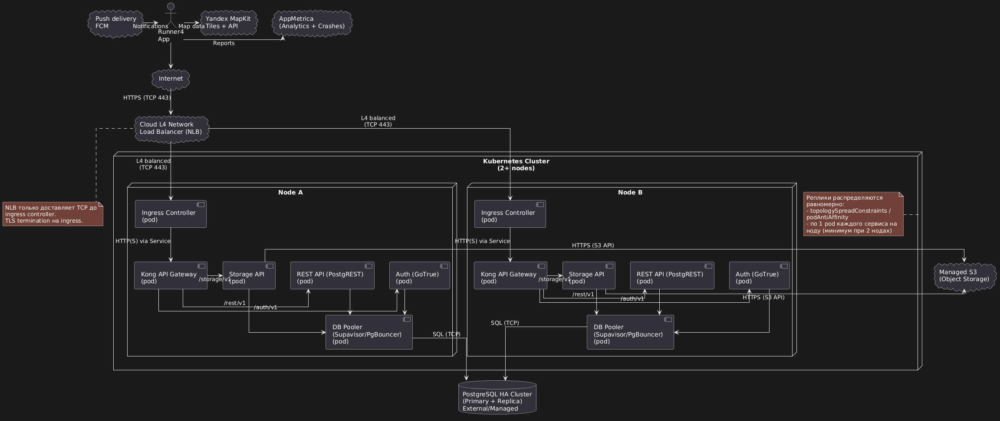

# 🏃 Runner4

Android-приложение для отслеживания пробежек с использованием GPS и облачной синхронизации данных.

> [!TIP]
> Актуальную версию приложения можно скачать в [разделе релизов](../../releases/latest) данного репозитория.

## ✨ Функциональные возможности

- **Аутентификация пользователей**: Регистрация и вход через Firebase Auth для обеспечения безопасности данных.
- **Мониторинг пробежек**: Отслеживание маршрута в реальном времени с использованием GPS.
- **Статистика тренировки**: Расчет пройденной дистанции, текущей продолжительности и средней скорости.
- **Работа в фоне**: Использование Foreground Service позволяет приложению продолжать запись маршрута даже при заблокированном экране или переключении на другие приложения.
- **История активностей**: Хранение списка всех пробежек в облаке с возможностью детального просмотра каждой из них.
- **Интеграция с картами**: Отображение маршрута на Google Maps.
- **Система отзывов**: Сбор обратной связи от пользователей напрямую через приложение.

## 🌐 Веб-приложение

Для удобного просмотра маршрутов на большом экране и управления историей доступно веб-приложение: [https://helow19274.github.io/Runner](https://helow19274.github.io/Runner).

**Возможности веб-версии:**
- **Синхронизация**: Вход в существующий аккаунт для доступа к своим данным.
- **Просмотр и удаление**: Удобный интерфейс для анализа прошлых маршрутов и удаления ненужных записей.
- **Публичный доступ**: Просмотр маршрутов по прямым ссылкам без необходимости авторизации. 
  *Пример маршрута:* [Демонстрация маршрута](https://helow19274.github.io/Runner?run=FMDByEmBHYTIgewi79og8fBnPNQ2!HA9r0Gh7UQk9Gdrvvwgb)

## 🛠️ Техническая реализация

Приложение построено на современном стеке технологий Android-разработки:

- **Язык программирования**: [Kotlin](https://kotlinlang.org/).
- **Архитектура**: Single Activity Pattern с использованием [Navigation Component](https://developer.android.com/guide/navigation) для управления переходами между экранами.
- **UI**: View Binding для безопасной работы с элементами разметки и Material Design 3 для современного внешнего вида.
- **Фоновые задачи**: [Foreground Service](https://developer.android.com/guide/components/foreground-services) гарантирует стабильное получение данных о местоположении в соответствии с политиками Android.
- **Местоположение**: [Google Play Services Location](https://developers.google.com/android/guides/setup) для высокоточного определения координат.
- **База данных**: [Firebase Firestore](https://firebase.google.com/docs/firestore) — NoSQL база данных для синхронизации данных между устройствами в реальном времени.
- **Расчеты**: Библиотека [Maps SDK for Android Utility Library](https://github.com/googlemaps/android-maps-utils) (SphericalUtil) для вычисления дистанции на основе географических координат.

## 🏗️ Архитектура

Приложение спроектировано с учетом разделения ответственности на несколько уровней:

- **UI Layer (Уровень представления)**: Построен на принципе Single Activity. Основные экраны реализованы в виде фрагментов, навигация между которыми управляется с помощью Jetpack Navigation Component.
- **Service Layer (Уровень сервисов)**: Включает в себя `RunService` — Foreground Service, который обеспечивает стабильное отслеживание GPS-координат даже при сворачивании приложения.
- **Domain Layer (Доменный уровень)**: Описывает основные сущности системы (`Run`, `Feedback`) и содержит вспомогательную логику для обработки данных тренировок.
- **Data Layer (Уровень данных)**: Отвечает за взаимодействие с Firebase (Firestore для хранения данных и Auth для аутентификации).
- **Infrastructure (Инфраструктура)**: Включает интеграцию с внешними SDK, такими как Google Maps SDK и Play Services Location.

### 📊 Диаграммы архитектуры

В папке [diagrams](diagrams) представлены визуальные схемы архитектуры и инфраструктуры приложения. Все исходники в формате PlantUML доступны там же.

#### 🧩 Логическая архитектура приложения
В папке проекта доступны две версии диаграммы: базовая и расширенная (со всеми связями).

**Базовая схема:**

**Расширенная схема:**

#### ☁️ Инфраструктурная схема (Google Cloud / Firebase)
Текущая реализация взаимодействия с облачными сервисами Firebase и Google Maps:

#### 🚀 Вариант масштабируемой инфраструктуры
Схема возможной миграции на self-hosted стек (Kubernetes, PostgreSQL) и отечественные сервисы:

## 📈 Crashlytics и Analytics

Для обеспечения качества и понимания того, как пользователи взаимодействуют с приложением, интегрированы сервисы Firebase:

- **Firebase Crashlytics**: В приложении настроен автоматический сбор отчетов о сбоях. Это позволяет разработчикам получать детальную информацию о причинах падений (стек вызовов, модель устройства, версия ОС) и исправлять их до того, как они затронут большое количество пользователей.
- **Firebase Analytics**: Используется для анализа ключевых метрик использования. В коде реализована установка `userId`, что позволяет агрегировать данные о поведении конкретных пользователей (при соблюдении политик конфиденциальности) и понимать, какие функции наиболее востребованы.

## 💬 Механизм сбора обратной связи

В приложении реализован встроенный механизм получения отзывов от пользователей:

- После завершения пробежки пользователю периодически отображается диалог обратной связи.
- Механизм включает в себя:
    - **Рейтинг**: Оценка приложения по 5-балльной шкале.
    - **Комментарий**: Возможность подробно описать свои впечатления или сообщить о проблеме.
- Все отзывы отправляются в Firestore в коллекцию `feedback`, привязанную к конкретному пользователю. Это обеспечивает структурированное хранение и удобный анализ фидбека для команды разработки.

## 📱 Тестирование на реальном устройстве

Тестирование на физических устройствах является критически важным этапом для Runner4 из-за специфики работы с сенсорами:

1. **Проверка GPS**: Тестирование проводилось в различных условиях (плотная городская застройка, парки, открытые пространства) для калибровки фильтрации "шумов" GPS.
2. **Жизненный цикл сервиса**: Проверка того, что Android-система не завершает `RunService` при низком заряде батареи или нехватке оперативной памяти.
3. **Энергопотребление**: Измерение расхода заряда батареи при длительном использовании GPS и поиск баланса между точностью и автономностью.
4. **Уведомления**: Проверка корректности отображения статуса пробежки в панели уведомлений и возможности быстрого возврата в приложение.
5. **Сенсорные прерывания**: Поведение приложения при входящих звонках, потере интернет-соединения или временной потере сигнала спутников.
